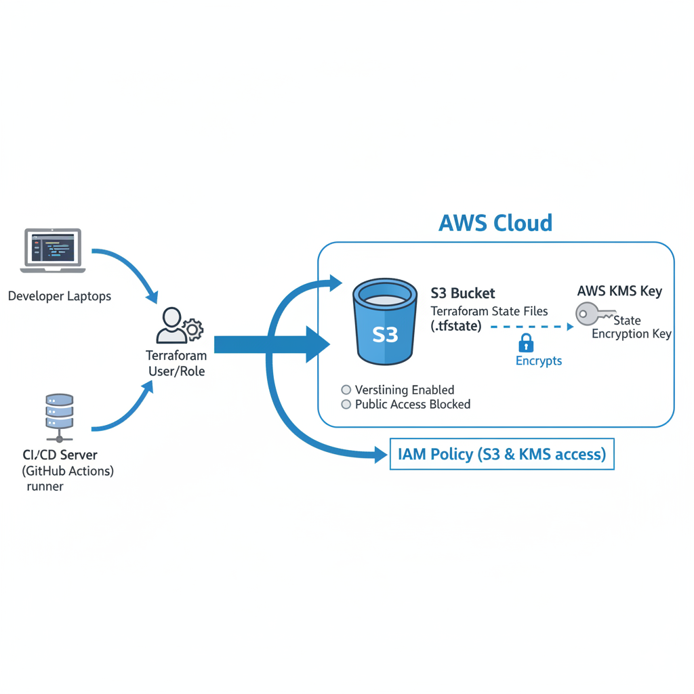

# Terraform S3 Backend: The Definitive Starter Kit

This repository provides a production-grade, reusable, and opinionated boilerplate for setting up and using the modern Terraform S3 backend on AWS. It is designed to be the single best-practice starting point for any new project.

The architecture is simple and robust: a secure, version-controlled, and encrypted S3 bucket stores your Terraform state files, leveraging S3's native consistency and locking features.



### Why This Approach?

This starter kit intentionally uses **S3's native object locking** and does **not** use a separate DynamoDB table. Here's why this is the superior, modern approach:

*   **Simpler Architecture:** Fewer moving parts means less to manage, secure, and pay for.
*   **Increased Resilience:** By relying on S3's strong read-after-write consistency and native locking, you remove a potential point of failure (the DynamoDB table).
*   **Lower Cost:** You are not paying for a separate AWS service (DynamoDB) for a feature that is now built into S3.
*   **Official Recommendation:** HashiCorp has deprecated the use of DynamoDB for S3 backend locking, making this the official, forward-looking pattern.

For teams maintaining older projects, a guide for migrating *away* from the legacy DynamoDB pattern is included in the `guides/` directory.

### Key Features & Best Practices

*   🔒 **Security by Default:** The S3 bucket is configured to block all public access.
*   🔑 **Encryption at Rest:** State files are encrypted using a dedicated AWS KMS key.
*   🔄 **State Protection:** S3 bucket versioning is enabled, allowing you to recover previous state versions in an emergency.
*   🚫 **Deletion Protection:** A `prevent_destroy` lifecycle block on the S3 bucket adds a crucial layer of safety.
*   🧩 **Modular & Reusable:** The backend infrastructure is defined separately from the example project that uses it.
*   📜 **Least-Privilege IAM Policy:** A ready-to-use IAM policy is provided for your Terraform users or CI/CD roles.

---

### Project Structure

```
.
├── 1-backend-setup/      # Terraform code to build the backend (S3, KMS)
├── 2-example-project/    # An example project configured to USE the backend
└── guides/               # Additional guides, including legacy pattern migration
```

---

## How to Use This Starter Kit

Follow these steps in order.

### Step 1: Build the Backend Infrastructure

This one-time setup creates the S3 bucket and KMS key.

1.  Navigate to the setup directory:
    ```bash
    cd 1-backend-setup
    ```

2.  Rename the example variables file:
    ```bash
    mv terraform.tfvars.example terraform.tfvars
    ```

3.  Edit `terraform.tfvars` and set your own globally unique `s3_bucket_name`.

4.  Initialize Terraform:
    ```bash
    terraform init
    ```

5.  Review and apply the plan to create the resources:
    ```bash
    terraform plan
    terraform apply
    ```
    Take note of the `s3_bucket_name` output, as you will need it for the next step.

6.  **(Optional but Recommended)** Migrate this project's own state to the backend you just created. Uncomment the `backend "s3"` block in `1-backend-setup/main.tf`, fill in your bucket name, and run `terraform init` again. Type `yes` when prompted to migrate the state.

### Step 2: Configure Your Project

Now, configure your main infrastructure project to use the backend.

1.  Navigate to the example project directory:
    ```bash
    cd ../2-example-project
    ```

2.  Edit the `backend.tf` file and replace the placeholder `bucket` value with the output from Step 1. Also, set a unique `key` for this project's state file.

3.  Initialize Terraform. It will detect the backend configuration and connect to it.
    ```bash
    terraform init
    ```

4.  You're all set! Now, any `terraform plan` or `apply` you run in this directory will use the remote S3 backend for state storage and locking.
    ```bash
    terraform plan
    terraform apply
    ```

---

### 🚨 Critical: IAM Permissions

Your Terraform user or role needs specific permissions to interact with the backend. Attach the following IAM policy, replacing the placeholders with your resource details.

```json
{
    "Version": "2012-10-17",
    "Statement": [
        {
            "Sid": "AllowS3StateStorage",
            "Effect": "Allow",
            "Action": [
                "s3:GetObject",
                "s3:PutObject",
                "s3:ListBucket"
            ],
            "Resource": [
                "arn:aws:s3:::<YOUR_BUCKET_NAME>/*",
                "arn:aws:s3:::<YOUR_BUCKET_NAME>"
            ]
        },
        {
            "Sid": "AllowKmsEncryption",
            "Effect": "Allow",
            "Action": [
                "kms:Decrypt",
                "kms:Encrypt",
                "kms:GenerateDataKey"
            ],
            "Resource": "arn:aws:kms:<REGION>:<ACCOUNT_ID>:key/<YOUR_KMS_KEY_ID>"
        }
    ]
}
```
**Note:** If you are migrating an existing project from the legacy DynamoDB locking pattern, see our migration guide in `guides/MIGRATING_FROM_DYNAMODB.md` for the additional permissions required.

---

## Operational Playbook

### A Note on Variable Management

For security and practicality, it is not recommended to edit the `variables.tf` file directly or pass variables on the command line. The best practice is to use a `terraform.tfvars` file. This repository includes a `terraform.tfvars.example` file to get you started. Since `*.tfvars` is included in the `.gitignore`, you can safely store your configuration values without committing them to the repository.

### CI/CD Integration Strategy

This backend is designed for automation. To use it in a CI/CD pipeline (like GitHub Actions, GitLab CI, or Jenkins), the runner/agent needs AWS credentials with the permissions outlined in the IAM policy.

**Recommended Approach: OpenID Connect (OIDC)**
For platforms like GitHub Actions or GitLab, OIDC is the most secure method. It avoids storing long-lived IAM access keys as secrets.
1.  Create an OIDC Provider in your AWS account for your CI/CD platform.
2.  Create an IAM Role that your CI/CD pipeline can assume.
3.  Attach the IAM Policy from this README to that role.
4.  Configure your pipeline to assume this role before running `terraform` commands.

### Enterprise Pattern: The Centralized Tooling Account

For larger organizations, it is a security best practice to create these backend resources in a dedicated, separate AWS account (often called a "Tooling," "Management," or "Shared Services" account). Your main infrastructure would be deployed into other accounts (e.g., "Dev," "Prod"), and cross-account IAM roles would be used to grant access to the state files. This isolates your state from your application environments, providing a critical layer of security and blast radius reduction.

---

## Long-Term Maintenance & Disaster Recovery

### Cost Management & State Cleanup

S3 versioning is critical for safety, but it will store every single version of your state file forever. To manage costs, an optional `aws_s3_bucket_lifecycle_configuration` resource is included (commented out) in `1-backend-setup/main.tf`. If you enable it, it will automatically:
1.  Transition state file versions older than 30 days to a cheaper storage tier (Standard-IA).
2.  Permanently delete state file versions older than 365 days.

### Emergency State Recovery Playbook

If your latest state file ever becomes corrupted, you can use S3 versioning to recover. **Do not run `terraform apply` if you suspect corruption.**

1.  Navigate to the S3 bucket in the AWS Management Console.
2.  Find your state file object (e.g., `production/web-app/terraform.tfstate`).
3.  Click on the object and go to the **"Versions"** tab.
4.  Identify the last known-good version by its timestamp and **Download** it as a backup.
5.  With the good version still selected, promote it to be the current version.
6.  Return to your terminal and run `terraform plan`. It should now show a plan based on the restored state.

---

## Advanced Usage: Managing Multiple Environments

A single project state is simple, but in reality, you will have multiple environments like `dev`, `staging`, and `production`. Here are two standard patterns for managing them with this backend.

### Pattern 1: Directory-Based Isolation (Recommended for Clarity)

This pattern uses a separate directory for each environment, providing strong isolation.

```
.
├── environments/
│   ├── dev/
│   │   ├── backend.tf   # key = "dev/web-app/terraform.tfstate"
│   │   └── main.tf
│   └── prod/
│       ├── backend.tf   # key = "prod/web-app/terraform.tfstate"
│       └── main.tf
└── modules/
    └── web-app/         # Reusable module for the web application
```
*   **Pros:** Very explicit. It's impossible to accidentally apply `dev` changes to `prod`. Promotes the use of reusable modules.

### Pattern 2: Terraform Workspaces (Recommended for Simplicity)

Terraform's built-in workspaces feature allows you to use the same code to manage different state files.

1.  **Configure your backend `key`** to use the workspace variable:
    ```terraform
    key = "env:/${terraform.workspace}/web-app/terraform.tfstate"
    ```
2.  **Manage environments with CLI commands:**
    ```bash
    terraform workspace new dev
    terraform workspace select dev
    terraform plan # Uses the dev state file
    ```
*   **Pros:** Less code repetition. Quick to switch between environments.
*   **Cons:** Higher risk of human error (e.g., forgetting to switch from `prod` to `dev` before running `apply`).
